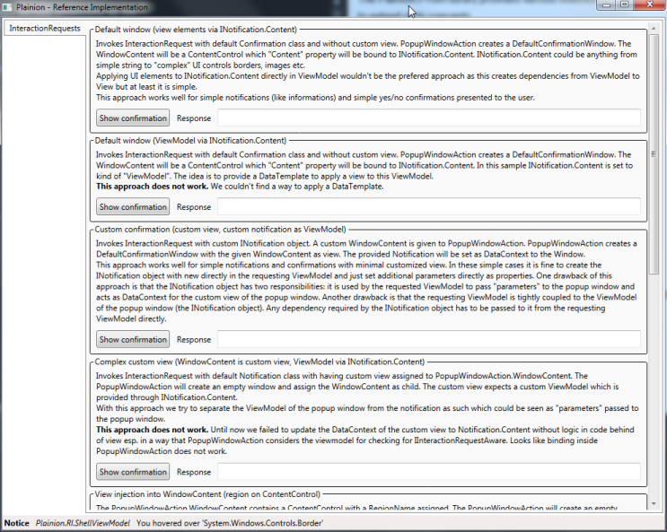

The Plainion.Prism library provides various extensions to the 
[Prism library](https://github.com/PrismLibrary) to simplify the usage and to extend of its concepts. 

## Plainion.Prism.Interactivity

This namespace provides MVVM compatible dialog integration for various common use cases

- "Exit without save" handling dialog: ExitWithoutSaveView and ExitWithoutSaveNotification allow popup
  of "Save changes?" dialog using MVVM friendly InteractionRequest
- "Common" dialogs: open the following common dialogs through InteractionRequestions
  - File open
  - File save
  - Select folder
- Print dialog: handle printing in MVVM style through InteractionRequests, Notifications and IPrintRequestAware

Furthermore it provides general helpers to handle dialogs in an MVVM environment

- PopupViewAction: more flexible PopupWindowAction
- PopupWindowActionRegionAdapter: RegionAdapter to enable Prism to directly inject views into a PopupWindowAction
- PopupWindowContentControl: ContentControl implementing IInteractionRequestAware to perfectly fit into
  PopupwindowActions and to easily support view injection via Prism

## Plainion.Prism.Mvvm

- ValidatableBindableBase implments INotifyDataErrorInfo and serves as a base class for views
  which require input validation

## Plainion.Prism.Regions

- StackPanelRegionAdapter is a Prism RegionAdapter which enables Prism to inject views directly 
  into StackPanels

## Prism.RI

Use the reference implementation (Prism.RI.exe) to play around with the extensions provided by 
this library.

